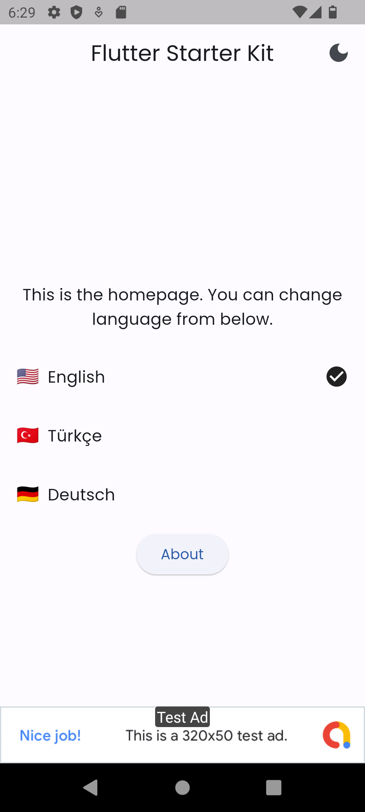

# Flutter Starter Kit

Flutter Starter Kit is a simple starter app that provides a solid foundation for building Flutter
applications. It includes core functionalities such as state management, theme changing,
localization, and AdMob integration.

## Getting Started

Follow the steps below to set up the Flutter Starter Kit on your local machine.

### Step 1: Clone Git Repository

To clone Flutter Starter Kit, follow these steps:

1. Open the folder that you want to clone the repo.
2. Run Terminal in the folder.
3. Run this command in
   Terminal: `git clone https://github.com/harundemir918/flutter_starter_kit.git [enter your app name]`
   .

### Step 2: Change Git Origin

To change Git origin of Flutter Starter Kit, follow these steps:

1. Open the folder of your project.
2. Run a Terminal and run this
   command: `git remote add origin https://github.com/[your GitHub username]/[your GitHub repository].git`
   .

### Step 3: Update Package Name

To change the package name of the Flutter Starter Kit, follow these steps:

1. Run this command in Terminal: `flutter pub global activate rename`.
2. Then run these commands one-by-one:
   `flutter pub global run rename --bundleId [your package name]`
   `flutter pub global run rename --appname "[your app name]"`
   `flutter pub global run rename --appname [your app name] --target ios`
   `flutter pub global run rename --appname [your app name] --target android`
   `flutter pub global run rename --appname [your app name] --target web`
   `flutter pub global run rename --appname [your app name] --target macOS`
   `flutter pub global run rename --appname [your app name] --target windows`

### Step 4: Update AdMob ID

1. Open the file `android/app/src/main/res/values/api_keys.xml`.
2. Replace the test AdMob ID with your own AdMob ID.
3. Copy the file `lib/core/config/config_example.dart` as `lib/core/config/config.dart`, and change
   the IDs with your own IDs. You can add new ones if you wish.

### Step 5: Update App Name And Other Texts

To change the app name in Flutter Starter Kit, follow these steps:

1. Replace the default app name with your own name. The texts are located
   at `lib/core/constants/string_constants.dart`.
2. You can add or edit texts according to your needs.
3. Use them in your app.

### Step 6: Update App Icon

To change the app icon in Flutter Starter Kit, follow these steps:

1. Replace the default app icon with your own icon file. The default app icon is located
   at `assets/images/logo.png`.
2. Open the terminal and navigate to the project directory.
3. Run the command `dart run flutter_launcher_icons` to apply the changed app icon.

### Step 7: Translate Files

To translate the app into different languages, follow these steps:

1. Open the file `lib/core/translations/translation_keys.dart`.
2. Describe the translation keys you want to use in your app.
3. Go to the `lib/core/translations/langs` folder.
4. Update the translation files according to the desired language. You can add new ones if you wish.
5. If you added new language files, register them in `lib/core/translations/languages.dart`.
6. Define the recently added languages in `lib/core/data/languages_list.dart`.

### Step 8: Adding New Controllers

To add new controllers to app, follow these steps:

1. Controllers are in `lib/core/controllers/` folder. Open the folder.
2. Create your controller (e.g. `SettingsController`) in a new folder (e.g. `settings`).
3. Register your controller in `lib/main.dart` with `Get.put()`.
4. Define your controller in `lib/core/base/base_controller.dart` with `Get.find()`.
5. You can use it like `BaseController.settingsController`.

### Step 9: Theming

To customize app theme, follow these steps:

1. Theme file is in `lib/core/constants/theme_constants.dart`. Open the file.
2. There are settings for dark and light theme. You can add new properties (e.g. `textTheme`), or
   edit existing properties.
3. You can use them in your app with `Theme.of(context)`.

## Features

- State management using Get.
- Theme changing functionality.
- Localization support.
- AdMob integration for showing ads.
- Comparing versions in app markets.

## Contributing

Contributions to Flutter Starter Kit are welcome! If you find any issues or have suggestions for
improvements, please submit a pull request or open an issue on the GitHub repository.

## License

Flutter Starter Kit is released under the [MIT License](https://opensource.org/licenses/MIT). You
are free to use, modify, and distribute this starter kit.

## Contact

For any further questions or inquiries, you can open a pull request. Thanks!